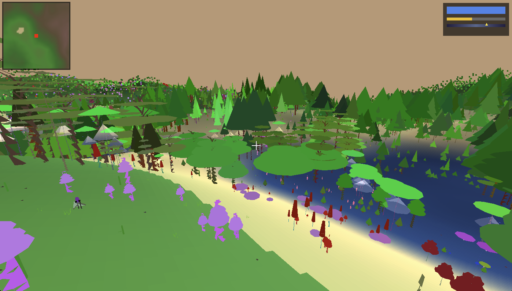
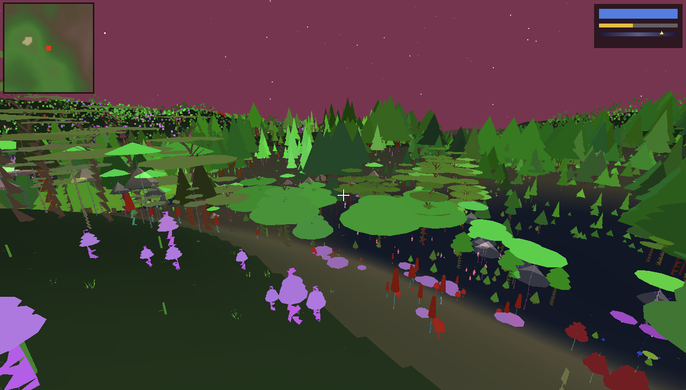

# Waverse

An infinite procedural world built from stacked wave functions. Terrain, plants, and creatures are all generated from DNA-like structures that mutate and crossover as you explore.

**[Watch the demo on YouTube](https://www.youtube.com/watch?v=tkcycnBBNF4)**



## What is this?

Waverse generates terrain by stacking sine waves, perlin noise, and other wave functions on top of each other. Think of it like a Fourier transform for landscapes. The result is an infinite world you can walk or fly through in real-time.

Plants and animals have their own DNA that controls their shape, color, and behavior. When new chunks of the world are generated, they inherit and mutate DNA from neighboring chunks. This creates gradual variation as you travel - forests slowly shift in character, creatures change form.

Even the sky evolves: sun size, moon glow, star density, and sky tints are all genetic and shift very slowly as you explore.



## Key Features

**Terrain Generation**
- Waves stacked on waves: sin, cos, perlin, ridged noise
- Continental-scale variation with lower frequency base waves
- Continuous infinite world via chunk system
- Background worker pre-generates chunks ahead of you
- Terrain colors evolve per-chunk via DNA

**Flora DNA**
- 15 plant types: grass, flowers, ferns, bushes, trees, pines, palms, willows, cacti, mushrooms, coral, crystals, alien forms
- Multi-segment trunks, branches, canopies
- Neighboring chunks crossover DNA to create gradual biome transitions

**Fauna DNA**
- 10 animal types: insects, birds, fish, mammals, reptiles, amphibians, jellyfish, worms, metroids, alien creatures
- Size variance from small critters to large beasts
- Articulated bodies with animated joints
- Simple AI: wander, graze, flock, swarm, flee

**Sky DNA**
- Sun and moon sizes/colors evolve across chunks
- Star count and brightness shift gradually
- Sky tints change over long distances
- Day/night cycle with shifting orbital paths

## Running It

```bash
pip install -r requirements.txt
python main.py
```

To clear cached chunks and regenerate:
```bash
python main.py --clear-cache
```

## Controls

| Key | Action |
|-----|--------|
| WASD / Arrows | Move |
| H / Space | Fly up |
| F / Shift | Fly down / Land |
| IJKL | Look around |
| Right-click + Mouse | Mouse look |
| 1-5 | Movement speed (1=slow, 5=fast) |
| S | Save position |
| ESC | Exit |

## How DNA Crossover Works

Each chunk has pools of DNA templates for terrain colors, plants, animals, and sky. When a new chunk generates:

1. It looks at what DNA exists in neighboring chunks
2. It picks parents from those neighbors
3. It creates offspring via crossover (blending traits) and mutation (random changes)
4. The offspring become the parameters for the new chunk

Terrain colors mutate slowly (15% chance per chunk). Sky parameters mutate very slowly (5% chance). This means if you walk in one direction, you'll see gradual shifts in everything - flora, fauna, colors, even the sun. Walk far enough and the world looks completely different.

## Project Structure

```
waverse/
  dna.py          - Plant DNA with genes for growth, color, features
  animal_dna.py   - Animal DNA with body segments, limbs, AI behavior
  chunk_dna.py    - Terrain color and sky DNA that evolves per-chunk
  flora.py        - Plant rendering with LOD
  animals.py      - Animal rendering and AI updates
  world.py        - Terrain generation from wave configs
  chunk_worker.py - Background thread for pre-generating chunks
  explorer.py     - OpenGL renderer and game loop
  sky.py          - Day/night cycle, sun, moon, stars
```

## License

MIT
